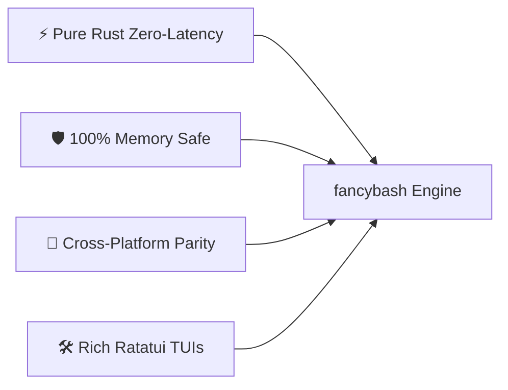

# 🗺️ fancybash Project Roadmap

Welcome to the **fancybash** project roadmap! This document outlines our product vision, architectural principles, past release milestones, and planned future enhancements.

> [!NOTE]
> This roadmap represents our current strategic direction. Feature priorities may evolve based on community feedback, user proposals, and contributions.

---

## 📌 Table of Contents

- [1. Core Vision & Design Philosophy](#1-core-vision--design-philosophy)
- [2. Release Milestones & History](#2-release-milestones--history)
  - [v1.0.0 — Legacy Shell Architecture](#v100--legacy-shell-architecture)
  - [v2.0.0 — Pure Rust Core Engine & Ratatui TUI Era](#v200--pure-rust-core-engine--ratatui-tui-era)
  - [v2.2.0 — Parallel Compressor & Multi-Tool Suite](#v220--parallel-compressor--multi-tool-suite)
- [3. Near-Term Roadmap (v2.3 — v2.5)](#3-near-term-roadmap-v23--v25)
- [4. Mid-Term & Long-Term Vision (v3.0+)](#4-mid-term--long-term-vision-v30)
- [5. How to Propose or Vote on Features](#5-how-to-propose-or-vote-on-features)

---

## 1. Core Vision & Design Philosophy

`fancybash` aims to be the ultimate, zero-latency Rust CLI suite for modern developers. All roadmap features must strictly adhere to four foundational pillars:

1. **⚡ Zero-Latency Execution**: Sub-millisecond prompt rendering and zero subshell overhead.
2. **🛡️ 100% Memory Safe**: `#![deny(unsafe_code)]` compliance across all sub-tools.
3. **🔄 Cross-Platform Parity**: Universal support across Linux (glibc/musl), macOS (Intel/M-Series), and Windows (MSVC).
4. **🛠️ Rich Ratatui TUI Suite**: Modern terminal UI components with fast keyboard navigation and fallback resilience.

---

## 2. Release Milestones & History

### v1.0.0 — Legacy Shell Architecture

- ✅ Initial shell script environment and aliases.

### v2.0.0 — Pure Rust Core Engine & Ratatui TUI Era

- ✅ Rebuilt entire core in pure Rust (`fancybash`).
- ✅ Integrated Ratatui TUI framework for terminal interactive tools.
- ✅ Added 55-theme interactive prompt switcher (`fancybash theme`).
- ✅ Implemented `vault` (AES-256 decoy guard), `todo`, `notes`, `filetree`, `process_manager`.

### v2.2.0 — Parallel Compressor & Multi-Tool Suite

- ✅ Added `compressor` with Level 1 Fast default, smart media store mode, and Rayon parallel thread pool.
- ✅ Added 24-in-1 `ffmedia` multimedia suite.
- ✅ Integrated GitHub Actions multi-target matrix release binaries (`x86_64`, `aarch64` ARM64).

---

## 3. Near-Term Roadmap (v2.3 — v2.5)

| Feature / Module                          |     Status     | Target Version | Description                                                 |
| :---------------------------------------- | :------------: | :------------: | :---------------------------------------------------------- |
| **📊 WebAssembly Terminal Widget**        | 🏗️ In Planning |    `v2.3.0`    | Browser-run WebAssembly binary preview for landing website. |
| **🤖 Local LLM AI Assistant**             | 🏗️ In Research |    `v2.4.0`    | Rust native client for local Ollama / llama.cpp CLI helper. |
| **🔍 Interactive Git Stash & Branch TUI** |  📅 Scheduled  |    `v2.5.0`    | Ratatui visual Git branch manager and stash inspector.      |

---

## 4. Mid-Term & Long-Term Vision (v3.0+)

- **🔌 Dynamic Plugin Submodules**: Load optional Rust tool plugins dynamically.
- **☁️ Encrypted Cloud Dotfile Sync**: Securely sync user prompt themes and alias configurations across machines using SSH/Gist.
- **⏱️ Micro-Benchmarking Suite (`fancybench`)**: Automated Criterion bench suite measuring sub-microsecond prompt telemetry.

---

## 5. How to Propose or Vote on Features

We encourage community participation! Visit [GitHub Discussions](https://github.com/rihadjahanopu/fancybash/discussions) to suggest ideas or report feature requests.
