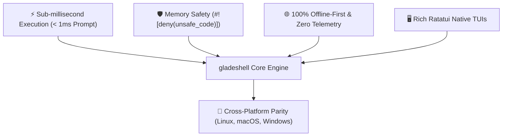

# 🗺️ gladeshell Product & Technical Roadmap

Welcome to the official **[gladeshell](https://github.com/rihadjahanopu/gladeshell)** roadmap. This document outlines our product vision, architectural pillars, historical milestones, and upcoming technical developments.

> [!NOTE]
> Priorities are driven by real-world developer workflows, community proposals, and performance benchmarks.

<div align="center">

[](https://github.com/rihadjahanopu/gladeshell/releases/tag/v1.1.0)
[](#)
[](https://github.com/rihadjahanopu/gladeshell/discussions)

</div>

---

## 📌 Table of Contents

- [1. Core Vision & Design Philosophy](#1-core-vision--design-philosophy)
- [2. Architectural Pillars](#2-architectural-pillars)
- [3. Historical Milestones & Current Release (v1.1.0)](#3-historical-milestones--current-release-v110)
- [4. Near-Term Roadmap (v1.2.0 — v1.3.0)](#4-near-term-roadmap-v120--v130)
- [5. Mid-Term & Long-Term Vision (v2.0.0+)](#5-mid-term--long-term-vision-v200)
- [6. Feature Proposal & Contribution Guide](#6-feature-proposal--contribution-guide)

---

## 1. Core Vision & Design Philosophy

`gladeshell` is designed to be the ultra-high-performance, zero-latency developer suite for modern terminals. Every roadmap initiative is measured against strict performance and security constraints:



---

## 2. Architectural Pillars

| Pillar | Principle | Enforcement Mechanism |
| :--- | :--- | :--- |
| ⚡ **Sub-Millisecond Latency** | Zero subshell forks, cold startup $\le 25\text{ ms}$, prompt render $< 1\text{ ms}$ | Criterion micro-benchmarks (`benches/`) & Fat LTO release binaries |
| 🛡️ **Memory Safety** | Zero unsafe code memory corruption vulnerabilities | `#![deny(unsafe_code)]` compile flags across core & tools |
| 🔒 **Zero-Trust Security** | 100% local execution, zero analytics, RAM memory zeroization | `zeroize` crate & AES-256-GCM encrypted vaults |
| 🖥️ **Native Terminal UI** | Responsive Ratatui TUI apps with fallbacks | Crossterm raw mode with terminal escape sanitization |
| 🔄 **Cross-Shell Parity** | Single binary powering Bash, Zsh, Fish, and PowerShell | Centralized `aliases.toml` & `clap_complete` engines |

---

## 3. Historical Milestones & Current Release (v1.1.0)

### 📦 v1.0.0 — Prototype Era
- ✅ Initial Bash script configuration and alias registry.
- ✅ Basic theme switcher proof-of-concept.

### 🚀 v1.1.0 — Pure Rust Core & Native CLI Suite (Current Production) `[RELEASED]`

```
Overall v1.1.0 Completion: [████████████████████] 100%
```

- ✅ **Pure Rust Engine Architecture**: Rebuilt core in 100% safe Rust with sub-millisecond execution.
- ✅ **Native Auto-Completions (`gladeshell completions <shell>`)**: Built-in `clap_complete` generator for Bash, Zsh, Fish, PowerShell, and Elvish with auto-eval shell init integration.
- ✅ **55 Prompt Themes**: Tokyo Night, Catppuccin, Dracula, Matrix, Rose Pine, and 50 more available with single-command instant switching (`gladeshell theme <name>`).
- ✅ **Native IDE Setup Commands (`zed-setup` & `code-setup`)**: Bulletproof settings installers across Native, Flatpak, Snap, and Windows AppData paths.
- ✅ **Level 1 Fast Parallel Multi-Core Compressor (`cmp` / `ex`)**: Multi-core archive compressor with smart media store mode.
- ✅ **Hardened Security Vault (`vault`)**: AES-256-GCM memory-guarded directory vault with panic decoy mode.
- ✅ **Automated GitHub Release Pipeline**: Version bump auto-detection, tag creation (`vX.Y.Z`), 7-OS compilation matrix, binary stripping (`strip`), and `CHANGELOG.md` auto-extraction.

---

## 4. Near-Term Roadmap (v1.2.0 — v1.3.0)

### 🎯 Phase 1 — v1.2.0 (Target: Q4 2026) `[IN PROGRESS]`

```
Phase 1 Progress: [████████░░░░░░░░░░░░] 40%
```

| Feature / Module | Status | Target | Description |
| :--- | :---: | :---: | :--- |
| 🌿 **Git Branching & Stash Visualizer TUI** | 🏗️ In Development | `v1.2.0` | Native Ratatui TUI for interactive git rebase, stash inspection, and branch switching. |
| 🎨 **Interactive Theme Studio (`glade-studio`)** | 🧪 Prototyping | `v1.2.0` | Built-in TUI wizard to create, preview, and save custom prompt themes live. |
| 🌐 **WASM Web Playground** | 📅 Scheduled | `v1.2.0` | WebAssembly-compiled terminal simulator embedded on `gladeshell.netlify.app`. |

### 🎯 Phase 2 — v1.3.0 (Target: Q1 2027) `[PLANNED]`

```
Phase 2 Progress: [██░░░░░░░░░░░░░░░░░░] 10%
```

| Feature / Module | Status | Target | Description |
| :--- | :---: | :---: | :--- |
| 🤖 **Local AI Coding & Terminal Assistant (`glade-ai`)** | 🔬 Researching | `v1.3.0` | Native client for local Ollama / llama.cpp models for offline terminal command generation. |
| ☁️ **Encrypted Dotfile & Vault Sync** | 📅 Scheduled | `v1.3.0` | End-to-end encrypted backup and sync of themes, aliases, and vault configurations. |
| ⚡ **Criterion Micro-Benchmarking Suite (`gladebench`)** | 🏗️ In Planning | `v1.3.0` | Automated sub-microsecond prompt telemetry performance benchmarking utility. |

---

## 5. Mid-Term & Long-Term Vision (v2.0.0+)

- **🔌 Dynamic Rust Plugin Submodules**: Modular Rust plugin registry allowing users to extend `gladeshell` subcommands without recompiling the core.
- **🖥️ Cross-Platform GUI Configuration Panel**: Lightweight desktop companion app for managing themes, keybindings, and system metrics.
- **🌐 Package Manager Repositories**: Direct distribution through Homebrew (`brew install gladeshell`), Arch AUR (`yay -S gladeshell`), WinGet (`winget install gladeshell`), and Crates.io (`cargo install gladeshell`).

---

## 6. Feature Proposal & Contribution Guide

We actively welcome community feedback and contributions! 

1. **Propose a Feature**: Open a discussion on **[GitHub Discussions](https://github.com/rihadjahanopu/gladeshell/discussions)** or submit an issue using the `feature_request` template.
2. **Contribute Code**: Read our **[CONTRIBUTING.md](CONTRIBUTING.md)** guidelines and open a Pull Request.
3. **Security Reports**: Review **[SECURITY.md](SECURITY.md)** for responsible disclosure procedures.
