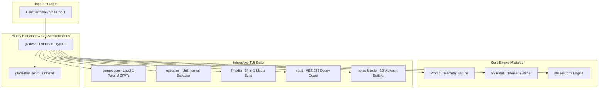

# 📖 gladeshell Official Technical Wiki

<div align="center">

```
   ██████╗ ██╗    █████╗ ██████╗ ███████╗███████╗██╗  ██╗███████╗██╗   ██╗
  ██╔════╝ ██║   ██╔══██╗██╔══██╗██╔════╝██╔════╝██║  ██║██╔════╝██║   ██║
  ██║  ███╗██║   ███████║██║  ██║█████╗  ███████╗███████║█████╗  ██║   ██║
  ██║   ██║██║   ██╔══██║██║  ██║██╔══╝  ╚════██║██║  ██║██╔══╝  ██║   ██║
  ╚██████╔╝██████╗██║  ██║██████╔╝███████╗███████║██║  ██║███████╗██████╗██████╗
   ╚═════╝ ╚═════╝╚═╝  ╚═╝╚═════╝ ╚══════╝╚══════╝╚═╝  ╚═╝╚══════╝╚═════╝╚═════╝
```

### ⚡ Comprehensive Developer & Technical Guide for gladeshell

_Pure Rust Architecture • Hyper-Optimized CLI Engine • Interactive Ratatui TUIs • Complete Command API_

<br>

[](https://opensource.org/licenses/MIT)
[](https://www.rust-lang.org/)
[](#)
[](#)
[](https://gladeshell.netlify.app)

</div>

---

## 📌 Table of Contents

- [1. Wiki Overview \& Vision](#1-wiki-overview--vision)
- [2. Architectural Design \& Core Mechanics](#2-architectural-design--core-mechanics)
  - [2.1 High-Level Architecture](#21-high-level-architecture)
  - [2.2 Execution Order \& Lifecycle](#22-execution-order--lifecycle)
  - [2.3 Memory Safety \& Bound Guarantees](#23-memory-safety--bound-guarantees)
- [3. Installation \& Environment Setup](#3-installation--environment-setup)
  - [3.1 Prerequisites](#31-prerequisites)
  - [3.2 Universal One-Line Installer](#32-universal-one-line-installer)
  - [3.3 Cargo Build from Source](#33-cargo-build-from-source)
  - [3.4 Clean Uninstallation Protocol](#34-clean-uninstallation-protocol)
- [4. Smart Prompt \& TUI Theme Engine](#4-smart-prompt--tui-theme-engine)
  - [4.1 Two-Line Layout Structure](#41-two-line-layout-structure)
  - [4.2 Dynamic Context Engine](#42-dynamic-context-engine)
  - [4.3 Real-time System Metrics \& Telemetry](#43-real-time-system-metrics--telemetry)
  - [4.4 55-Theme Switcher Engine](#44-55-theme-switcher-engine)
- [5. Complete Command \& Interactive TUI Suite](#5-complete-command--interactive-tui-suite)
  - [5.1 Multi-Threaded Parallel Compressor (`compressor`)](#51-multi-threaded-parallel-compressor-compressor)
  - [5.2 High-Speed Extractor (`extractor`)](#52-high-speed-extractor-extractor)
  - [5.3 FFmedia 24-in-1 Multimedia Suite (`ffmedia`)](#53-ffmedia-24-in-1-multimedia-suite-ffmedia)
  - [5.4 Interactive Task Manager (`todo`)](#54-interactive-task-manager-todo)
  - [5.5 Terminal Notes Editor (`notes`)](#55-terminal-notes-editor-notes)
  - [5.6 AES-256 Decoy Security Vault (`vault`)](#56-aes-256-decoy-security-vault-vault)
  - [5.7 Process & System Monitor (`process_manager` / `sysmon`)](#57-process--system-monitor-process_manager--sysmon)
  - [5.8 Directory Traversal & Navigation](#58-directory-traversal--navigation)
  - [5.9 Git Version Control Matrix](#59-git-version-control-matrix)
- [6. Multi-Platform \& Shell Parity](#6-multi-platform--shell-parity)
  - [6.1 Linux Distributions Support](#61-linux-distributions-support)
  - [6.2 macOS Terminal Integration](#62-macos-terminal-integration)
  - [6.3 Windows PowerShell 7+ Strategy](#63-windows-powershell-7-strategy)
- [7. Editor \& VS Code Integration](#7-editor--vs-code-integration)
- [8. Configuration \& Custom Overrides](#8-configuration--custom-overrides)
- [9. Developer Guide \& Contribution Protocol](#9-developer-guide--contribution-protocol)

---

## 1. Wiki Overview & Vision

**gladeshell** is a production-ready, zero-dependency, hyper-optimized pure Rust binary CLI suite engineered specifically for modern full-stack web developers, DevOps engineers, and system administrators.

Built in safe Rust with `#![deny(unsafe_code)]` constraints, **gladeshell** eliminates external subshell execution delays, delivering instantaneous prompt rendering and multi-threaded parallel performance across Linux, macOS, and Windows.

> [!NOTE]
> **Core Technical Promise**: Pure Rust compilation. Zero background subshell latency. Non-destructive shell integration via atomic backup.

---

## 2. Architectural Design & Core Mechanics

### 2.1 High-Level Architecture

The gladeshell engine consists of four primary decoupled layers:



### 2.2 Memory Safety & Bound Guarantees

gladeshell enforces strict memory safety guarantees:

- **Zero Unsafe Code**: Compiles with `#![deny(unsafe_code)]` across core modules.
- **Bounded Buffers**: Dynamic UI containers calculate exact bounds without hardcoded offsets.
- **Parallel I/O**: Multi-core archive compression utilizes Rayon thread pools and 2MB high-throughput buffered streams.

---

## 3. Installation & Environment Setup

### 3.1 Universal One-Line Installer

Automated installer script auto-detects OS (Linux/macOS/Windows) and CPU architecture (`x86_64` / `aarch64` ARM64):

```bash
curl -fsSL https://gladeshell.netlify.app/install.sh | bash
```

### 3.2 Cargo Build from Source

For Rust developers building directly from source:

```bash
git clone https://github.com/rihadjahanopu/gladeshell.git
cd gladeshell
cargo build --release
make install
```

### 3.3 Clean Uninstallation Protocol

`gladeshell` provides 100% non-destructive uninstallation:

```bash
gladeshell uninstall
# OR via installer script
./install.sh --uninstall
```

---

## 4. Smart Prompt & TUI Theme Engine

### 4.1 Two-Line Layout Structure

The gladeshell prompt renders real-time telemetry with sub-millisecond latency:

```text
🌐 web-project 📂 42M [🌿 main ❗] 🌡️ 48°C 💽 120G free ⚖️ 0.45 ⏱️ 3s
🟢 v20.11.0 │ 📦 10.2.4 │ 🥐 1.1.0 │ 🐧 6.8.0 │ 📅 Sep 30 │ 🧠 4.1G/16G │ 🔋98%
❯❯❯
```

### 4.2 55-Theme Switcher Engine

Select from 55 interactive Ratatui prompt themes (Catppuccin, Nord, Cyberpunk, Tokyo Night, Dracula, Rose Pine) with live terminal preview:

```bash
gladeshell theme
```

---

## 5. Complete Command & Interactive TUI Suite

### 5.1 Multi-Threaded Parallel Compressor (`compressor`)

`gladeshell compressor` runs hyper-optimized parallel multi-core compression:

- **Default Level**: Level 1 (Fast - Max Speed)
- **Supported Formats**: ZIP, 7z, TAR.GZ, TAR.XZ, TAR.BZ2, TAR
- **Smart Store**: Automatically detects pre-compressed media (MP4, MKV, MP3, PNG) to prevent CPU waste.

### 5.2 High-Speed Extractor (`extractor`)

`gladeshell extractor <file>` auto-detects archive signatures and unpacks archives at maximum I/O speed.

### 5.3 FFmedia 24-in-1 Multimedia Suite (`ffmedia`)

24-in-1 interactive media toolkit for video compression, audio extraction, GIF generation, and EXIF metadata stripping.

### 5.4 Interactive Task Manager (`todo`)

Ratatui TUI task manager supporting task creation, priority tagging, filtering, and JSON persistence.

### 5.5 Terminal Notes Editor (`notes`)

Fast terminal note taker featuring 2D viewport navigation, multi-line paste support, and full-text search.

### 5.6 AES-256 Decoy Security Vault (`vault`)

AES-256 encrypted directory vault with decoy password triggers, RAM execution guards, and panic wipe capability.

---

## 6. Editor & VS Code Integration

Pre-configured VS Code settings (`.vscode/settings.json`) enable `rust-analyzer` live linting:

- **`clippy` on Save**: Automatically runs `cargo clippy` on file save.
- **Debugger**: Pre-configured CodeLLDB launcher (`.vscode/launch.json`).
- **Tasks**: `Ctrl+Shift+B` shortcuts for `cargo build`, `cargo test`, `cargo clippy`, and `cargo fmt`.

---

## 7. Developer Guide & Contribution Protocol

Contributors must verify code before submitting pull requests:

```bash
make check      # Run cargo check across all targets
make clippy     # Run Clippy lints (-D warnings)
make fmt        # Format Rust source code
make test       # Execute unit test suite
```

---

<div align="center">

**Maintained with ❤️ by Rihad Jahan Opu**

[Website](https://gladeshell.netlify.app) • [GitHub Repository](https://github.com/rihadjahanopu/gladeshell) • [Report Issue](https://github.com/rihadjahanopu/gladeshell/issues)

</div>
